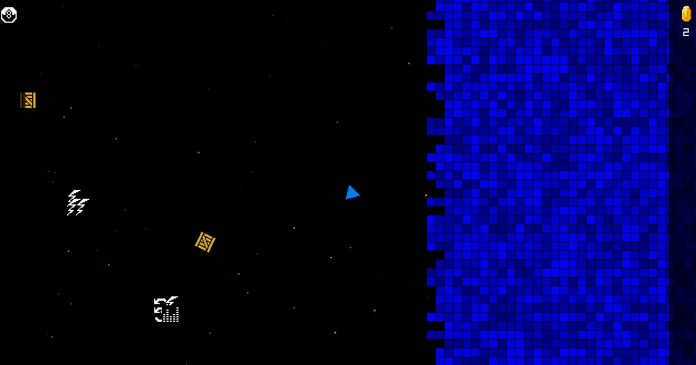

# 2D Topdown Shooter
A basically working layout for a 2D top down shooter, shoot boxes & collect coins, shoot powerup blocks for power ups using Raylib for graphics

Left CTRL - Shoot 
Left Alt - Increase speed 
Z - Default speed 
Numpad Delete/. - Debug 

